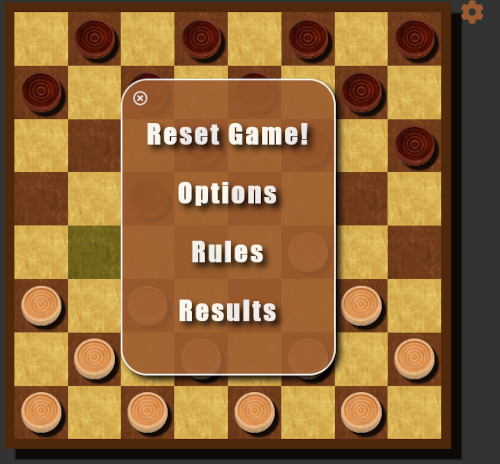
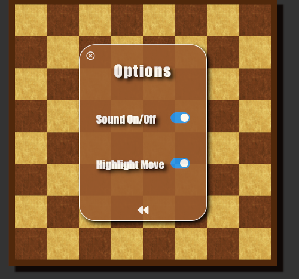
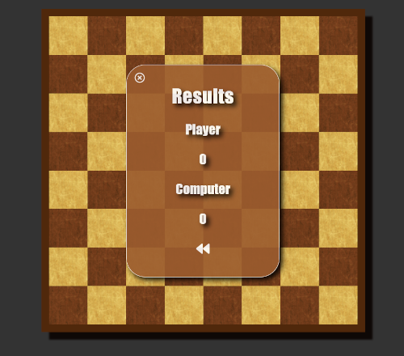

# Checker's Game

## Introduction

The Checker's Game is a game that consists of a board with 64 squares, 32 of which are occupied by 16 black and 16 white pieces. The pieces are placed in the 12 squares closest to each player. The objective of the game is to capture all the opponent's pieces or to block them so that they cannot move. There are many variations of the game. The rules implemented in this project are based on the international rules but using a 8x8 board.
The game code was developed in javascript and the interface was developed in HTML and CSS.

<a href="https://cafalchio.github.io/checkers_game/" rel="nofolow">Visit and play the live version of the game here</a>

The game can be played on any device, including small mobile phones as smaller as (250 x 300 px).

## Table of Contents

- [Checker's Game](#checkers-game)
  - [Introduction](#introduction)
  - [Table of Contents](#table-of-contents)
  - [UX](#ux)
      - [Strategy](#strategy)
  - [Technologies](#technologies)
  - [Features](#features)
    - [Main Page](#main-page)
    - [Options Menu](#options-menu)
    - [Rules Menu](#rules-menu)
    - [Results Menu](#results-menu)
    - [Game](#game)
  - [Testing](#testing)
  - [Unfixed Bugs](#unfixed-bugs)
  - [Features Left to Implement](#features-left-to-implement)
  - [Deployment](#deployment)
  - [Credits](#credits)
  - [Acknowledgements](#acknowledgements)

## UX

#### Strategy

- Site goals

  - The main goal of the site is to provide a fun and interactive game for the user to play.
  - To have a pleasant wood theme that is easy to use and navigate.
  - To have a responsive design that is easy to use on any device.
  - With a intuituve menu that is easy to use and navigate.

- User goals
  - The user goals are to have a fun and interactive game to play.
  - The user can play the game on any device.

## Technologies

The technologies used in this project were HTML, CSS and JavaScript. The HTML was used to create the structure of the page, the CSS was used to style the page and the JavaScript was used to make the entire game work.

    * HTML
    * CSS
    * JavaScript
    * GitHub
    * GIMP

## Features

### Main Page

The main page is the first page that the user sees when they visit the site. It has four buttons, one to start the game, one to see the rules, one to see the options and one to see the results. Once the player has started the game, the the Start Game button will be replaced by a button to restart the game.
All menus pages have a button to return to the main page and a button to close the menu.

### Options Menu

The options menu allows the user to change the game settings. The user can change the sound On/Off and the higlight On/Off. The highlight is the highlight of the possible moves of the selected piece. The sound is the sound of the pieces moving and the sound of the pieces being captured.

### Rules Menu

The rules menu shows the rules of the game. The rules are based on the international rules but using a 8x8 board. The text can be scrolled up and down.

### Results Menu

The results menu shows the results of the game. The results are the number of games won by the player and the number of games won by the computer. The results are saved in the local storage of the browser.

### Game

The game page is where the game will be played, it has a board with 64 squares, 32 of which are occupied by 16 black and 16 white pieces. The pieces are placed in the 12 squares closest to each player. The objective of the game is to capture all the opponent's pieces or to block them so that they cannot move.
Once in the Game, the user can go back to the menu using the small cog icon in the top right corner of the screen.

## Testing

The website was tested on a desktop computer and a mobile phone.
Also, W3C and Jigsaw validation was used to validate the website HTML and CSS.

W3C Validation:

[W3C](assets/images/readme/W3C.png) -->

Jigsaw Validation:

Jshint validator was used to validate the JavaScript code.

One warning here but was part of the implementation of the game.
Functions declared within loops referencing an outer scoped variable may lead to confusing semantics.

Lighhouse mobile and desktop testing:

## Unfixed Bugs

- dragging
  Sometimes the user can drag the background, which is not the desired behavior.

## Features Left to Implement

- The game could be played in two players mode.
- A timer could be added to the game.

## Deployment

- The game was deployed on GitHub pages.

## Credits

- Stack Overflow

## Acknowledgements

- My mentor for saving me from starting in a wrong way, which would make the project impossible to finish.
- My colleagues for the slack channel.
- The student tutors for the help.
